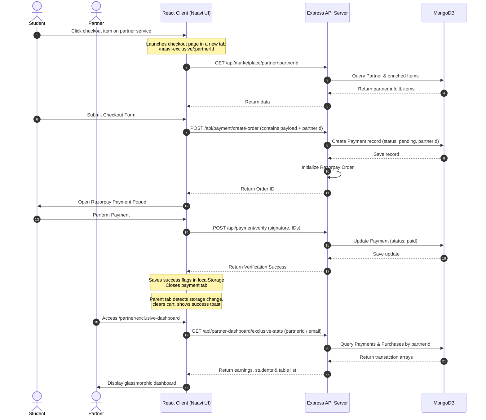

# Naavi Exclusive Checkout & Partner Dashboard Flow

This document details the architecture, connection points, and end-to-end data flow of the **Naavi Exclusive Page** (External Partner Checkout) and the **Partner Exclusive Analytics Dashboard**.

---

## 1. Overview
The Naavi Exclusive system enables external platform partners to sell their courses, mentoring sessions, and path bundles directly via a dedicated checkout page. The system is split into two primary components:
1. **Student Checkout View** (`/naavi-exclusive/:partnerId`): A dedicated payment processor page.
2. **Partner Analytics View** (`/partner/exclusive-dashboard`): A dark-themed, glassmorphic overview page for partners to track earnings, student counts, transaction logs, and real student feedbacks.

---

## 2. Architectural Data Flow

Below is the step-by-step transaction flow, showing how the frontend, backend, and MongoDB collections interact:



---

## 3. Endpoints & Schema Bindings

### A. Database Models
* **`Payment` (`PaymentModel.js`)**: Stores Razorpay transactional records. Linked to the partner via:
  ```javascript
  partnerId: { type: String, default: null }
  ```
* **`Purchase` (`PurchaseModel.js`)**: Stores manual/CRM client purchases. Linked via:
  ```javascript
  partnerId: { type: String, default: null }
  ```
* **`Feedback` (`FeedbackModel.js`)**: Holds student comments. Linked via:
  ```javascript
  owner_id: { type: String } // Matches partner email or ID
  ```

### B. Express Routing & Controllers
* **Order Creation**: `POST /api/payment/create-order`
  * Reads `partnerId` from the payload and inserts it directly into the initial `Payment` document.
* **Verification**: `POST /api/payment/verify`
  * Verifies payment signatures, marks the document status as `paid`, and triggers wallet tokens rewards.
* **Dashboard Stats**: `GET /api/partner-dashboard/exclusive-stats?partnerId=NVP-XXX&email=partner@x.com`
  * Aggregates financial totals (Total Earnings), counts unique customer emails (Active Students), compiles transaction lists (Online Payments & Direct Purchases), and resolves real student feedbacks.

---

## 4. Key Implementation Details

### A. Cross-Tab Synchronization
To prevent students from losing their dashboard state when checking out in a new tab:
1. The checkout page writes a temporary success key (`naaviExclusiveSuccess`) to `localStorage` and executes `window.close()`.
2. The parent tab listens to the browser's `storage` event:
   ```javascript
   window.addEventListener("storage", (e) => {
     if (e.key === "naaviExclusiveSuccess" && e.newValue) {
       // Clear cart, trigger activation toast, and reload components
     }
   });
   ```
3. A backup interval polling mechanism is active to ensure instant synchronization if the window listener fails.

### B. Auto-Updating Session IDs
For legacy partners who logged in before unique ID auto-generation:
* The dashboard controller handles email-based fallbacks.
* If a partner logs in without a `partnerId` inside their client-side session, the `/exclusive-stats` backend endpoint resolves their unique ID by email, returns it to the client, and the frontend automatically syncs and saves it back into `localStorage`.
