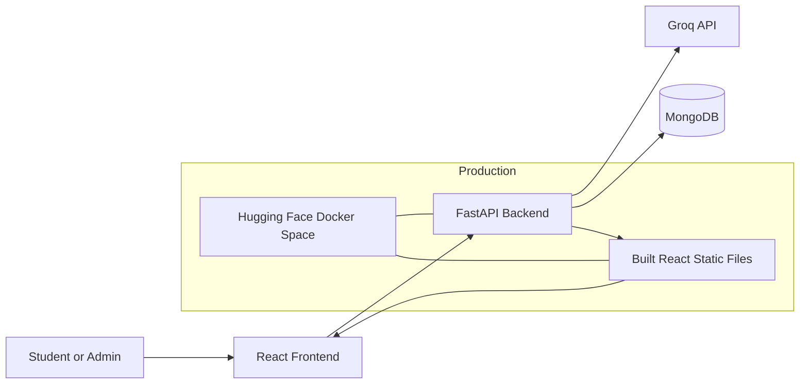
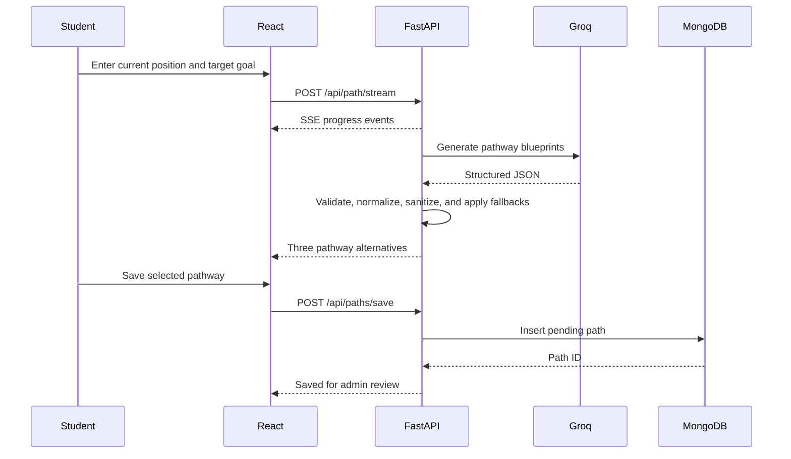
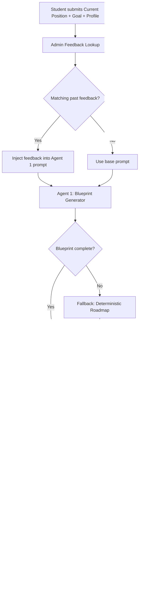
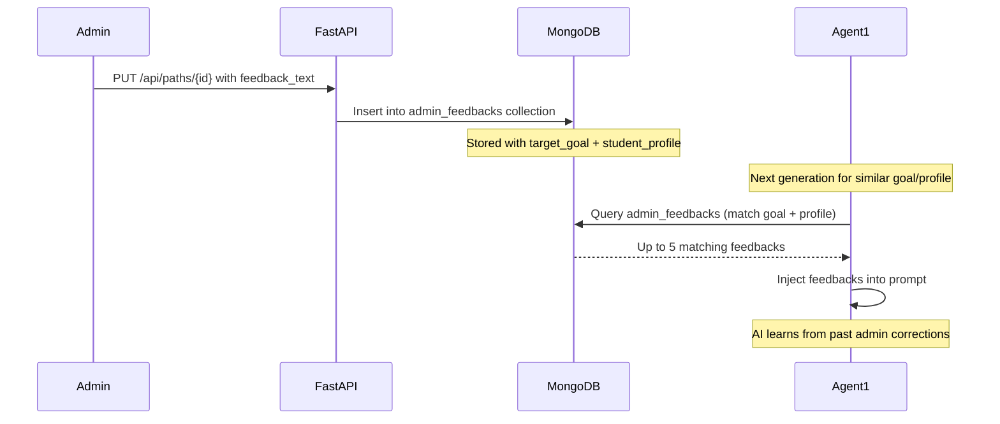
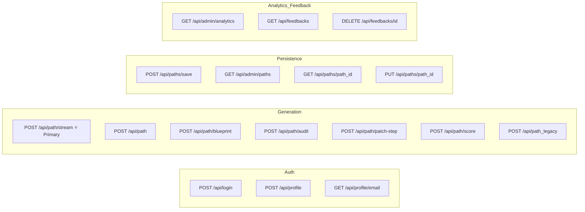
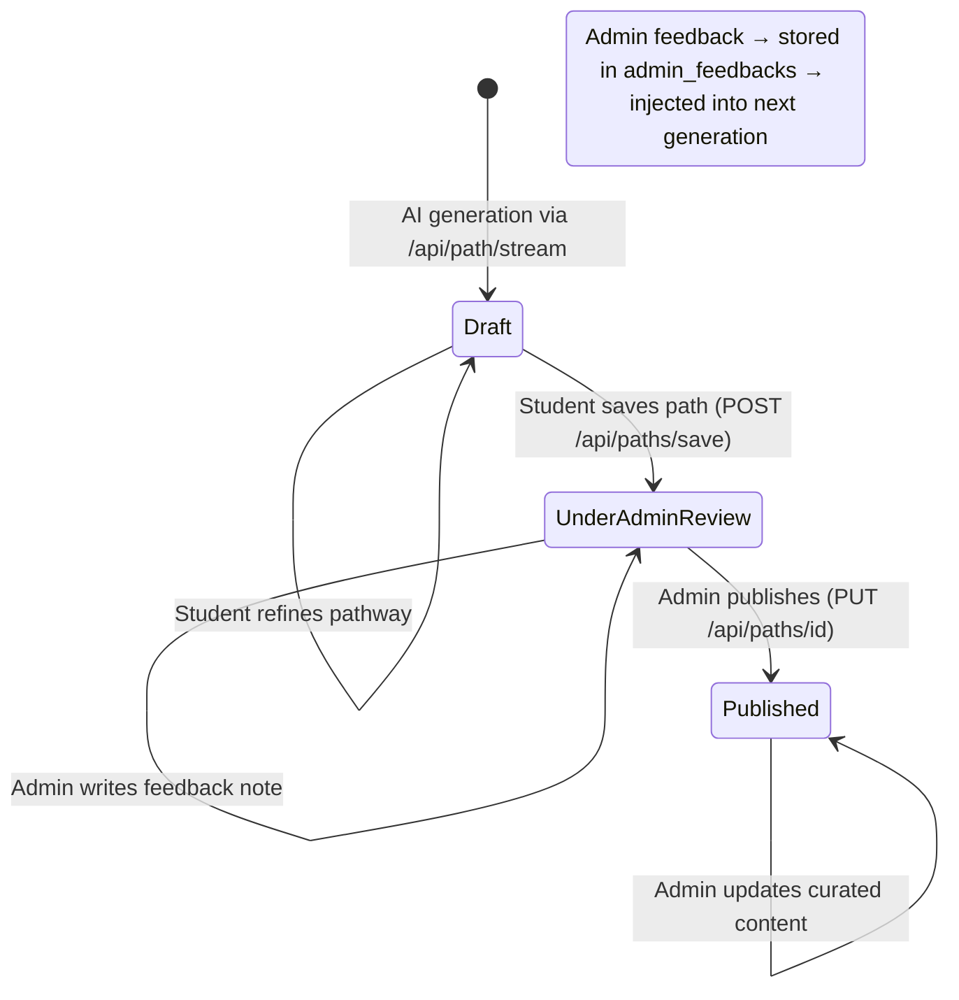
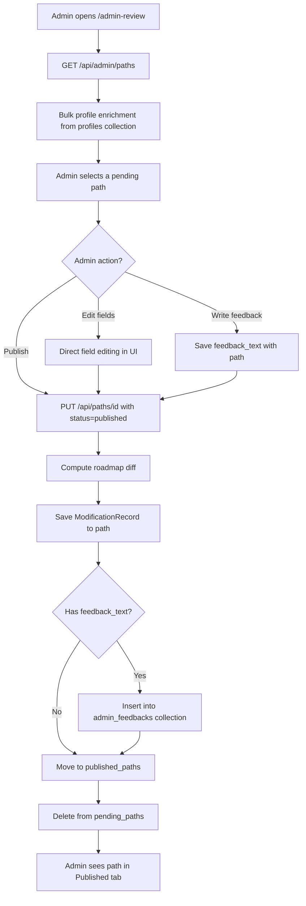

# Naavi Agent — Complete Project Overview

## 1. Project Summary

Naavi Agent is an AI-assisted education and career pathway platform. It helps a student move from a current academic position toward a future education or career goal by generating structured, personalized roadmaps.

The platform combines:
     
- Student profile information
- AI-generated pathway alternatives
- Milestone-level learning guidance
- Free, paid, institutional, and mentor resources
- Targeted AI refinement of individual roadmap fields
- Human review and publishing through an admin workflow

The application is a full-stack system:

- **Frontend:** React, Vite, React Router, Sass
- **Backend:** Python, FastAPI
- **AI provider:** Groq
- **Database:** MongoDB
- **Production hosting:** Hugging Face Docker Space

Live Space:

<https://huggingface.co/spaces/Naaviverse/Naaviverse-Path>

---

## 2. Product Purpose

Many students know their desired destination but do not know the sequence of academic, practical, and personal-development steps needed to reach it.

Naavi Agent addresses this by turning:

```text
Current position + student profile + target goal
```

into:

```text
Multiple pathway options
  → ordered milestones
  → macro, micro, and nano guidance
  → actionable checklists
  → relevant learning and mentoring resources
  → admin-reviewed published pathway
```

The system is designed for:

- School students exploring university or career options
- Students preparing for examinations and admissions
- Learners building technical skills and portfolios
- Students seeking internships, mentorship, or career guidance
- Administrators reviewing AI-generated recommendations

---

## 3. Main User Roles

### Student

A student can:

- Sign in or create a profile
- Store academic and personal context
- Enter a current position and target goal
- Generate three pathway alternatives
- Compare academic, practical, and holistic pathways
- Open individual milestones
- Review macro, micro, and nano guidance
- Browse resources for each milestone
- Refine a complete pathway
- Surgically refine one field in one step
- Save a pathway for admin review

### Administrator

An administrator can:

- Sign in using admin credentials
- View pathways awaiting review
- View published pathways
- Inspect the associated student profile
- Edit pathway title, description, milestones, and durations
- Edit macro, micro, and nano guidance
- Add, edit, or remove marketplace resources
- Add or delete milestones
- Publish approved pathways
- Export pathway information to PDF

---

## 4. Core Concepts

### Pathway Alternatives

The primary generation flow creates up to three alternatives:

1. **Academic & Research**
   - School performance
   - Academic rigor
   - Entrance and language examinations
   - Research
   - University preparation

2. **Practical & Industry**
   - Technical skills
   - Projects
   - Portfolios
   - Certifications
   - Internships

3. **Holistic & Career-Prep**
   - Communication and soft skills
   - Peer learning
   - Community participation
   - Counseling
   - Mentorship

The frontend allows the user to switch between alternatives. A focused regeneration can regenerate only a selected alternative.

### Milestones

Each pathway contains an ordered `macro_path` array. Every milestone includes:

- Step ID
- Title
- Duration
- Description
- Macro view
- Micro view
- Nano view
- Actionable micro-steps
- Marketplace resources

### Three Guidance Levels

#### Macro View

The big-picture meaning and strategic outcome of the milestone.

#### Micro View

Detailed execution guidance explaining how the student should complete the milestone.

#### Nano View

Personalized support, feedback, review, mentorship, and accountability guidance.

### Marketplace Provider Schema

Each milestone marketplace is organized by four provider types:

| Section | Purpose | Typical items |
|---|---|---|
| `mentors` | Human guidance and accountability | Mentors, counselors, coaches, expert reviews |
| `vendors` | Learning and service providers | Courses, platforms, certifications, bootcamps |
| `institutions` | Formal organizations | Universities, colleges, schools, academies |
| `distributors` | Content and access channels | Books, documentation, communities, publications |

Provider items include:

- `category` / `provider_type`
- `structure`
- `discount`
- `cost` or `price`
- `duration`
- `why`, `value`, `next_step`, or `expected_outcomes`
- `tags`
- `section` / `view` for Macro, Micro, and Nano placement

For backward compatibility, the backend still emits the legacy view buckets:

- `macro_free`
- `micro_structured`
- `nano_expert`

---

## 5. High-Level Architecture



### Request Flow



---

## 6. Repository Structure

```text
Navi-Agent/
├── Dockerfile                     # Production multi-stage Docker build
├── README.md                      # Basic setup and Hugging Face metadata
├── PROJECT_OVERVIEW.md            # Current comprehensive project documentation
├── NAAVI_REFINE_PROMPTS.md        # User-facing refinement prompt examples
├── NAAVI_PATHWAYS_AND_REFINE_GUIDE.md
├── NAAVI_ACCURACY_REPORT.md
├── assets/
│   └── prompt-templates.md
├── code/
│   ├── main.py                    # FastAPI app, AI pipeline, APIs, MongoDB access
│   ├── models.py                  # Pydantic domain and database models
│   ├── requirements.txt           # Python dependencies
│   ├── Dockerfile                 # Backend-only container definition
│   └── .env                       # Local secrets; never commit
├── frontend/
│   ├── package.json               # Frontend dependencies and scripts
│   ├── vite.config.js
│   ├── public/                    # Static images and icons
│   └── src/
│       ├── App.jsx                # App shell, routing, navigation, shared state
│       ├── App.css
│       └── pages/
│           ├── authflow.jsx       # Login and profile onboarding
│           ├── Dashboard.jsx      # Path generation and refinement
│           ├── Dashboard.scss
│           ├── StepDetail.jsx     # Macro/micro/nano milestone detail
│           ├── Marketplace.jsx    # Resource browsing
│           ├── ProfileDetails.jsx # Student profile editor
│           ├── ProfileSummary.jsx # Compact profile summary card widget
│           ├── PathResult.jsx     # Standalone path result display
│           ├── Analytics.jsx      # Admin analytics dashboard with charts
│           ├── Analytics.scss
│           ├── Adminreview.jsx    # Review, curation, publishing, PDF export
│           ├── Adminreview.scss
│           └── Icons.jsx
├── docs/                          # Legacy prototype documentation
└── scratch/                       # Development and diagnostic scripts
```

> The files under `docs/` describe an earlier Claude-based prototype and do not fully represent the current implementation. This document should be treated as the current project-level reference.

---

## 7. Frontend Architecture

### Application Shell

`frontend/src/App.jsx` is responsible for:

- Authentication state
- Current student profile
- Current pathway data
- Selected pathway alternative
- Selected milestone
- Selected macro/micro/nano view
- Sidebar and mobile navigation
- Route transitions
- Browser storage synchronization

### Routes

| Route | Component | Purpose |
|---|---|---|
| `/` | Redirect | Redirects to the dashboard |
| `/dashboard` | `Dashboard` | Generate, compare, refine, save, and delete pathways |
| `/profile` | `ProfileDetails` | View and update student information |
| `/step-detail` | `StepDetail` | Inspect one milestone and its three guidance levels |
| `/marketplace` | `Marketplace` | Browse milestone resources |
| `/admin-review` | `AdminReview` | Review and publish generated pathways |
| `/analytics` | `Analytics` | Admin analytics dashboard with KPIs and charts |

### Browser Storage

The frontend uses browser storage for convenience:

| Key | Storage | Purpose |
|---|---|---|
| `nv_session` | `sessionStorage` | Current signed-in email |
| `nv_profile_<email>` | `localStorage` | Cached student profile |
| `nv_path_data_<email>` | `localStorage` | Current generated pathway |
| `nv_user_input_<email>` | `localStorage` | Current position and target goal |

Browser storage is a UI cache, not the authoritative database for reviewed or published pathways.

### API URL Selection

Frontend pages use:

```javascript
import.meta.env.VITE_API_URL ||
  (import.meta.env.DEV ? "http://127.0.0.1:8001" : "")
```

Therefore:

- Local development defaults to `http://127.0.0.1:8001`
- Production uses same-origin API requests
- `VITE_API_URL` can override the backend URL

### Important Frontend Features

#### Dashboard

- Accepts current position and target goal
- Shows streamed generation progress with per-agent status indicators
- Displays three alternative pathways with Accuracy Score badge per alternative
- Supports full-path refinement
- Detects targeted step refinement keywords and routes to surgical patch
- Calls the surgical patch endpoint when possible
- Saves a selected pathway to MongoDB for review
- Displays both Readiness Score and Accuracy Score on the pathway card

#### Step Detail

- Shows milestone description
- Provides Macro, Micro, and Nano tabs
- Connects each view to relevant marketplace resources
- Uses responsive layouts for desktop and mobile

#### Analytics Dashboard (`/analytics`)

- Admin-only view displaying live platform metrics
- KPI cards: Total Generated, Pending Review, Published, Average Review Time
- Line chart: Pathways generated vs published over the last 6 months
- Doughnut chart: Status breakdown (Published / Pending / Draft)
- Recent pathways table showing student name, goal, status, and step count
- Top goals bar chart showing most frequently requested career goals
- Falls back to mock data if the backend is unavailable

#### Admin Review

- Fetches pending and published paths with bulk-optimized profile enrichment
- Allows direct pathway curation for all roadmap fields
- Supports resource editing across all marketplace tiers
- Publishes pending records (moves from `pending_paths` to `published_paths`)
- Tracks and displays a diff-based edit modification history
- Captures admin feedback text which is stored and injected into future AI generations
- Generates PDF exports with `jsPDF` and `jspdf-autotable`

#### PathResult and ProfileSummary

- `PathResult.jsx`: Standalone display component for a single pathway result including readiness bar and score
- `ProfileSummary.jsx`: Compact profile card widget reused across multiple pages

---

## 8. Backend Architecture

The backend lives primarily in `code/main.py`.

It is responsible for:

- FastAPI application setup
- CORS handling
- Environment loading
- Groq clients
- MongoDB connection
- Profile persistence
- Pathway generation
- Streaming progress events
- Fallback roadmap generation
- Personal-name sanitization
- Step-level refinement
- Pending and published pathway workflows
- Serving the production React application

### Startup Behavior

At startup, the backend:

1. Loads environment variables.
2. Creates synchronous and asynchronous Groq clients.
3. Connects to MongoDB.
4. Uses the `naaviagent` database.
5. Ensures these collections exist:
   - `profiles`
   - `pending_paths`
   - `published_paths`
   - `generation_history`
   - `admin_feedbacks`

### Static Frontend Serving

In production, FastAPI serves `frontend/dist`.

The custom `SPAStaticFiles` class falls back to `index.html` for unknown frontend paths, allowing React Router routes such as `/dashboard` and `/admin-review` to work after a browser refresh.

---

## 9. AI Generation Pipeline

### Primary Flow

The recommended endpoint is:

```http
POST /api/path/stream
```

It returns Server-Sent Events (SSE), allowing the frontend to display progress while generation is running.

### Generation Pipeline Flow



### Pipeline Stages

#### Agent 1 — Blueprint Generation

- Builds pathway blueprints in parallel for all three focus types
- Injects relevant past admin feedback into the prompt before sending to Groq
- Uses the student profile, current position, goal, optional refinement, and pathway focus
- Requires a minimum number of milestones (6–12 depending on grade)
- Falls back to a deterministic `get_fallback_mock_roadmap()` if Groq output is incomplete

#### Agent 2 — Path Validation

- Normalizes pathway `path_title` and `path_description`
- Ensures these path-level fields are present and coherent
- Runs in parallel with Agents 3 and 4

#### Agent 3 — Milestone Validation

- Validates milestone coverage for all steps
- Ensures milestone IDs are sequential
- Audits `description`, `learning_objectives`, `macro_view`, `micro_view`, `nano_view`, and `micro_steps`

#### Agent 4 — Marketplace and Action Validation

- Audits `marketplace` blocks across all milestones
- Ensures provider buckets (`mentors`, `vendors`, `institutions`, `distributors`) are present, with legacy Macro/Micro/Nano buckets preserved for compatibility
- Adds fallback resources when generated content is incomplete

### Readiness Score Calculation (`calculate_path_metrics`)

After the AI pipeline completes, a deterministic Python function calculates the readiness score:

```
Readiness Score = Base Score (from academic performance %)
                 + Curriculum Match Boost (CBSE / IB / IGCSE)
                 + Stream Boost (Science / Commerce)
                 + Goal Relevance Boost (university/degree keywords)
                 − Competitive Penalty (Harvard / MIT / IIT → ×0.70)
```

| Path Type | High Performance Base | Medium Performance Base | Low Performance Base |
|---|---|---|---|
| Academic & Research | 55 | 35 | 20 |
| Practical & Industry | 50 | 40 | 30 |
| Holistic & Career-Prep | 45 | 35 | 25 |

Each path type produces a different readiness score for the same student.

### Path Accuracy Score Calculation (`calculate_path_accuracy_score`)

A second deterministic function audits the quality of the AI-generated roadmap:

```
Accuracy Score = 100 × (0.30 × S_steps + 0.40 × S_info + 0.30 × S_market)
```

| Pillar | Weight | What is Measured |
|---|---|---|
| S_steps | 30% | Step count vs expected (Gaussian bell curve) |
| S_info | 40% | Content density per step (desc + views + objectives + tasks) |
| S_market | 30% | Marketplace inside steps: resource presence, required-field quality, and relevance to each step |

### Admin Feedback Learning Loop

When an admin publishes or edits a path, they can optionally write a feedback note. This is stored in the `admin_feedbacks` collection and automatically injected into future Agent 1 prompts for similar goals or profiles:



### Progress Events

The streaming endpoint emits:

- `status` events containing progress, messages, and per-agent statuses
- `result` containing final alternatives with all scores attached
- `error` when generation cannot complete

Typical progress stages are:

| Progress | Meaning |
|---:|---|
| 20% | Creating pathway alternatives |
| 50% | Validating pathway-level data |
| 65% | Checking milestone coverage |
| 80% | Checking resources and actions |
| 90% | Preparing final recommendations |
| 100% | Alternatives ready |

### Reliability and Fallbacks

The backend contains deterministic fallback generation. If Groq:

- Times out
- Returns malformed JSON
- Returns too few milestones
- Returns incomplete marketplace data
- Raises an exception

the API returns a complete board-calibrated roadmap from `get_fallback_mock_roadmap()`.

### Privacy Sanitization

Generated output is passed through `recursive_sanitize()`. Personal name tokens from the profile and current-position text are detected and replaced with `"the student"` across all string fields in the roadmap.

---

## 10. Refinement System

Naavi supports two refinement modes.

### Full Path Refinement

The existing roadmap and a refinement prompt are sent through the generation pipeline. This is suitable for broad requests such as:

```text
Add more university preparation milestones.
Make the pathway more focused on machine learning.
Include more internships and portfolio projects.
```

### Surgical Step Refinement

The frontend detects requests targeting a specific step and field, then calls:

```http
POST /api/path/patch-step
```

Allowed fields:

- `description`
- `macro_view`
- `micro_view`
- `nano_view`
- `marketplace`
- `micro_steps`

This avoids regenerating unrelated pathway content.

For marketplace updates, the backend can replace one category in one subsection while preserving every unrelated resource.

Example:

```text
Update the mentors in the nano section of step 3.
```

The backend updates only the requested category and section.

Prompt examples are documented in:

- `NAAVI_REFINE_PROMPTS.md`
- `NAAVI_PATHWAYS_AND_REFINE_GUIDE.md`

---

## 11. API Reference

### Complete API Route Map



### Authentication and Profiles

| Method | Endpoint | Purpose |
|---|---|---|
| `POST` | `/api/login` | Validate administrator credentials |
| `POST` | `/api/profile` | Create or update a student profile |
| `GET` | `/api/profile/{email}` | Fetch a student profile |

### Pathway Generation

| Method | Endpoint | Purpose |
|---|---|---|
| `POST` | `/api/path/stream` | ⭐ Primary — Generate alternatives with SSE progress |
| `POST` | `/api/path` | Generate alternatives as a normal JSON response |
| `POST` | `/api/path/blueprint` | Generate an initial blueprint only |
| `POST` | `/api/path/audit` | Normalize/finalize a supplied blueprint |
| `POST` | `/api/path_legacy` | Backward-compatible simple goal endpoint |
| `POST` | `/api/path/patch-step` | Surgically update one field in one milestone |
| `POST` | `/api/path/score` | Compute Accuracy Score for a roadmap without generating |

### Persistence and Administration

| Method | Endpoint | Purpose |
|---|---|---|
| `POST` | `/api/paths/save` | Save a generated path for admin review |
| `GET` | `/api/admin/paths` | List pending, published, or all paths |
| `GET` | `/api/paths/{path_id}` | Fetch one complete path |
| `PUT` | `/api/paths/{path_id}` | Update or publish a path (also saves admin feedback) |

### Analytics and Feedback

| Method | Endpoint | Purpose |
|---|---|---|
| `GET` | `/api/admin/analytics` | Live KPI data for the Analytics dashboard |
| `GET` | `/api/feedbacks` | List all stored admin feedback entries |
| `DELETE` | `/api/feedbacks/{feedback_id}` | Delete a specific admin feedback entry |

### Example Generation Request

```json
{
  "current_position": "Grade 10 CBSE student",
  "target_goal": "Study computer science at a top university",
  "profile": {
    "grade": "Grade 10",
    "curriculum": "CBSE",
    "stream": "Science",
    "performance": "Above average",
    "financialSituation": "Moderate",
    "personality": "Analytical"
  },
  "refine_prompt": null,
  "existing_roadmap": null,
  "focus": null
}
```

### Example Save Request

```json
{
  "current_position": "Grade 10 CBSE student",
  "target_goal": "Study computer science at a top university",
  "profile": {
    "email": "student@example.com"
  },
  "roadmap_data": {
    "path_title": "Academic Pathway to Computer Science",
    "macro_path": []
  }
}
```

---

## 12. Data Model

### Student Profile

The profile includes:

- Name
- Email
- Grade
- Curriculum
- Stream
- School
- Academic performance
- Financial situation
- Personality
- Country
- State
- City
- Creation and update timestamps

### Roadmap

A roadmap generally contains:

```json
{
  "path_title": "string",
  "path_description": "string",
  "readiness_score": 65,
  "readiness_label": "Intermediate Starter",
  "total_duration": "24 months",
  "macro_path": [],
  "blind_spots": [],
  "db_id": null,
  "status": "draft",
  "option_name": "Academic & Research",
  "accuracy_score": 78,
  "accuracy_label": "High Accuracy",
  "accuracy_color": "#1a73e8",
  "accuracy_breakdown": {
    "structural": 85,
    "content": 72,
    "market": 80
  },
  "accuracy_details": {
    "step_count": 10,
    "expected_steps": 10,
    "s_steps": 1.0,
    "s_info": 0.72,
    "s_market": 0.80
  }
}
```

### Milestone

```json
{
  "id": 1,
  "title": "string",
  "duration": "string",
  "description": "string",
  "learning_objectives": [],
  "macro_view": "string",
  "micro_view": "string",
  "nano_view": "string",
  "micro_steps": [
    {
      "task": "string",
      "resource": "string"
    }
  ],
  "marketplace": {
    "mentors": [],
    "vendors": [],
    "institutions": [],
    "distributors": [],
    "macro_free": [],
    "micro_structured": [],
    "nano_expert": []
  }
}
```

---

## 13. MongoDB Collections and Path Lifecycle

### `profiles`

Stores student and administrator profile records.

The email address is normalized to lowercase and used for profile lookup.

### `pending_paths`

Stores pathways submitted for administrator review.

Typical status:

```text
under_admin_review
```

### `published_paths`

Stores approved pathways.

When a pending pathway is published:

1. The pending document is read.
2. The curated roadmap is inserted into `published_paths`.
3. A `published_at` timestamp is added.
4. The original pending document is deleted.

### `generation_history`

Logs every pathway generation event.

Each record contains:
- Timestamp
- Current position and target goal
- Full profile
- All generated alternatives
- Refinement prompt (if any)
- Parent generation ID (for refinement chains)
- Session email

Used to retrieve the original unmodified snapshot of an alternative when the student saves a path, enabling the admin to see exactly what was changed.

### `admin_feedbacks`

Stores free-text feedback written by admins during path review and publishing.

Each record contains:
- Admin email
- Target goal
- Student profile (grade, curriculum, stream, country)
- Feedback text
- Category (e.g., `general`, `resources`, `timeline`)
- Path ID reference

This collection powers the **Admin Feedback Learning Loop**: future Agent 1 prompts automatically include up to 5 relevant feedback entries that match the new request's goal or student profile. This allows admin corrections to improve AI output over time without retraining.

### Full Path Lifecycle



### Admin Review Workflow



---

## 14. Authentication Model

The current implementation provides a lightweight application login flow.

- Administrator credentials are validated by the backend.
- Student profile/session information is cached in browser storage.
- The backend does not currently issue JWTs or server-side sessions.
- API authorization is not enforced on every admin endpoint.

This is adequate for a controlled prototype, but production hardening should add:

- Password hashing
- JWT or secure cookie sessions
- Route-level role authorization
- Admin endpoint protection
- Login rate limiting
- Credential rotation
- Removal of fallback credentials from application code

Never commit `.env` files or credentials.

---

## 15. Environment Variables

### Backend

Create `code/.env` for local development:

```env
MONGODB_URI=mongodb_connection_string
GROQ_API_KEY=groq_api_key
ADMIN_USERNAME=admin_email
ADMIN_PASSWORD=strong_admin_password
```

Required:

| Variable | Purpose |
|---|---|
| `MONGODB_URI` | MongoDB connection string |
| `GROQ_API_KEY` | Groq API access |

Strongly recommended:

| Variable | Purpose |
|---|---|
| `ADMIN_USERNAME` | Administrator login email |
| `ADMIN_PASSWORD` | Administrator password |

### Frontend

Optional `frontend/.env`:

```env
VITE_API_URL=http://127.0.0.1:8001
```

Do not add secrets to frontend environment variables. Variables prefixed with `VITE_` are included in the browser bundle.

---

## 16. Local Development

### Prerequisites

- Python 3.11 or compatible version
- Node.js 20 or compatible version
- npm
- MongoDB database
- Groq API key

### Backend

```powershell
cd code
python -m venv .venv
.\.venv\Scripts\Activate.ps1
pip install -r requirements.txt
uvicorn main:app --reload --port 8001
```

Backend URL:

```text
http://127.0.0.1:8001
```

FastAPI documentation:

```text
http://127.0.0.1:8001/docs
```

### Frontend

```powershell
cd frontend
npm install
npm run dev
```

Frontend URL:

```text
http://localhost:5173
```

### Production Build

```powershell
cd frontend
npm run build
```

The generated files are written to `frontend/dist`.

---

## 17. Docker and Production Deployment

The root `Dockerfile` uses two stages.

### Stage 1 — Frontend Build

- Uses Node 20
- Installs npm dependencies
- Builds the Vite application

### Stage 2 — Application Runtime

- Uses Python 3.11
- Installs backend dependencies
- Copies backend code
- Copies the built frontend
- Starts Uvicorn on port `7860`

Production command:

```text
uvicorn main:app --host 0.0.0.0 --port 7860
```

### Hugging Face Space

The README front matter configures:

```yaml
sdk: docker
app_port: 7860
```

Add these values through the Hugging Face Space settings:

- `MONGODB_URI` as a secret
- `GROQ_API_KEY` as a secret
- `ADMIN_USERNAME` as a secret
- `ADMIN_PASSWORD` as a secret

The Space URL and secrets remain attached to the Space even when its source code is replaced from another Git repository.

---

## 18. External Services

### Groq

Used for:

- Roadmap blueprint generation
- Field-level rewriting
- Marketplace category replacement

### MongoDB

Used for:

- Profiles
- Pending pathways
- Published pathways

### CountriesNow API

The profile editor uses the CountriesNow public API to populate:

- Countries
- States
- Cities

If this external service is unavailable, location dropdowns may not populate correctly.

### Hugging Face Spaces

Used to:

- Build the Docker image
- Host the FastAPI backend
- Serve the React frontend

---

## 19. Quality, Safety, and Reliability Features

The current system includes:

- Validation of required current-position and goal fields
- Filtering of irrelevant refinement prompts
- Structured JSON prompting
- Model fallback selection
- Deterministic fallback roadmaps
- Minimum milestone requirements
- Marketplace completion checks
- Sequential milestone normalization
- Personal-name sanitization
- SSE heartbeat events during slow model calls
- MongoDB document serialization
- Mobile-responsive frontend layouts
- SPA routing fallback in production

---

## 20. Known Technical Considerations

### Security

- CORS currently permits all origins.
- Admin APIs are not protected by a reusable authorization dependency.
- Authentication does not currently use JWTs or secure server sessions.
- Default admin credential behavior should be removed before a public production launch.

### Validation

- Some API request and roadmap fields use generic dictionaries rather than strict Pydantic models.
- AI-generated resource claims are not externally verified.
- Generated course, mentor, price, or institution information may become outdated.

### Testing

The repository currently contains scratch diagnostic scripts, but it does not yet have a complete automated test suite.

Recommended additions:

- Backend unit tests
- API integration tests
- AI response contract tests
- Frontend component tests
- Mobile end-to-end tests
- Deployment smoke tests

### Documentation

The legacy files in `docs/` reference Claude and an older single-endpoint architecture. They should eventually be replaced or marked as archived to avoid confusion.

---

## 21. Recommended Future Improvements

### Product

- Student dashboard for saved and published pathways
- Admin comments and student revision requests
- Pathway version history
- Resource URLs and availability verification
- Progress tracking per milestone
- Notifications when a path is published
- Searchable published pathway library

### Engineering

- Split `code/main.py` into routers, services, repositories, and prompts
- Move prompts into dedicated versioned files
- Add strict response schemas for AI output
- Add database indexes, especially for email and timestamps
- Add structured logging and error monitoring
- Add caching and rate limiting
- Add background jobs for long AI generation tasks
- Add CI checks for linting, tests, and Docker builds

### Security

- Introduce role-based authentication
- Protect all admin routes
- Store password hashes rather than plaintext comparisons
- Restrict CORS to known frontend origins
- Add audit logging for admin changes
- Add API request limits and abuse protection

---

## 22. Source of Truth

For current behavior, use these files in this order:

1. `code/main.py`
2. `code/models.py`
3. `frontend/src/App.jsx`
4. Relevant component under `frontend/src/pages/`
5. `Dockerfile`
6. `PROJECT_OVERVIEW.md`

If documentation conflicts with executable code, the current code is authoritative.

---

## 23. Short Project Definition

Naavi Agent is a full-stack AI pathway-generation and curation platform that combines student context, Groq-powered roadmap generation, targeted refinement, marketplace recommendations, MongoDB persistence, and administrator publishing in a responsive React and FastAPI application deployed as a Hugging Face Docker Space.
